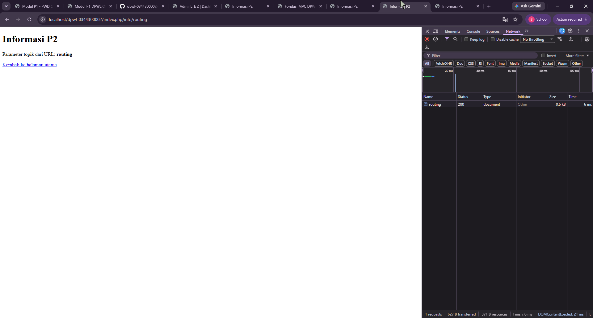
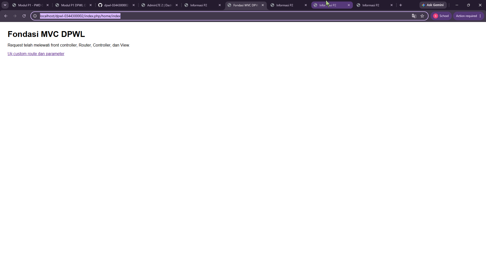

# Pertemuan 02 - Fondasi MVC Buatan Sendiri

## 1. Tujuan Praktikum
[Jelaskan tujuan P2 dengan kalimat sendiri.]

## 2. Struktur Direktori
[Tampilkan tree struktur P2 dan jelaskan fungsi setiap bagian.]

## 3. Front controller
[Jelaskan peran index.php sebagai satu titik masuk aplikasi.]

## 4. Routing dan Pemetaan URL
| URL/Route | Controller | Method | Parameter | View |
|---|---|---|---|---|
| / | Home | index | - | home/index.php |
| home/index | Home | index | - | home/index.php |
| home/info/mvc | Home | info | mvc | home/info.php |
| info/routing | Home | info | routing | home/info.php |

Tambahkan satu baris untuk route hasil Tahap Modifikasi ATM yang dibuat berdasarkan objek atau konteks aplikasi DPW, kemudian jelaskan pemetaan route → Controller → method → parameter → View.

## 5. Base URL dan Helper
Jelaskan fungsi base_url() dan site_url(), kemudian berikan contoh penggunaannya pada implementasi P2: 
- base_url() untuk memanggil assets/css/app.css; 
- site_url() untuk membentuk URL navigasi/route aplikasi.

## 6. Alur Request-response
Jelaskan dua alur berikut:

1. Alur eksekusi aktual P2:
Browser → index.php → Router → Controller → View → Response.
2. Posisi Model dalam arsitektur MVC lengkap:
Browser → index.php → Router → Controller → Model → basis data/data → Model → Controller → View → Response.

Pada implementasi P2, Model belum digunakan karena akses dan pengelolaan basis data mulai diimplementasikan pada P3.

## 7. Hasil Pengujian dan Debugging
Catat skenario pengujian valid dan tidak valid beserta hasilnya. Jika ditemukan kesalahan selama implementasi, dokumentasikan sekurang-kurangnya satu proses debugging yang memuat:

Gejala → Penyebab → Perbaikan → Hasil Uji Ulang

Jika seluruh implementasi langsung berjalan sesuai hasil yang diharapkan, jelaskan hasil pemeriksaan sintaks dan pengujian yang telah dilakukan.

## 8. Bukti Tangkapan Layar
Sisipkan gambar yang relevan dari folder dokumentasi/ dengan perintah:

### Gambar 1. Hasil Pengujian Halaman Utama 
 

### Gambar 2. Hasil Pengujian Custom Route 

## 9. Kesimpulan P2
Jelaskan apa yang sudah dapat dilakukan kerangka MVC dan apa yang baru akan ditambahkan pada P3.
